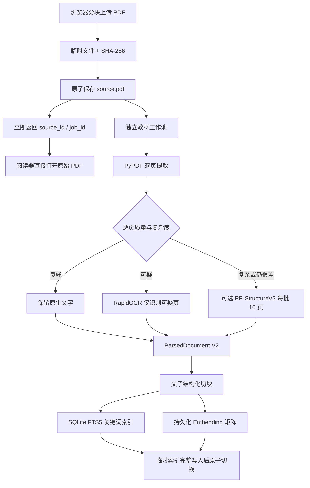
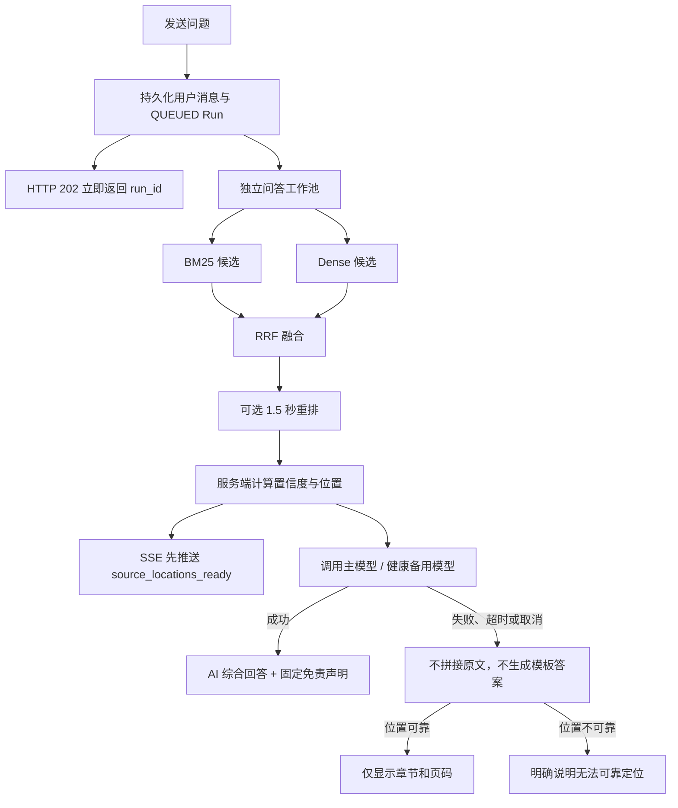

# BookMind 教材处理与问答 V2 实现说明

本文说明本轮已经落到代码中的处理链路、接口和运行边界。原始 PDF 始终是阅读真源；解析结果只负责目录、搜索、选中文本层、检索和定位。

## 1. 教材处理数据流



关键产物：

- `data/uploads/<user>/<book>/source.pdf`：原始文件，上传完成即可阅读。
- `data/parsed/<hash>/<parser-version>/<config-fingerprint>/document.json`：带页码、坐标、块类型、置信度和逐页质量的统一解析结果。
- `data/indexes/<book>/chunks.json`：父子切块及来源信息。
- `data/indexes/<book>/keywords.sqlite3`：预分词后的 FTS5 关键词索引。
- `data/indexes/<book>/vectors.npy` 和 `index_meta.json`：按模型、版本和维度标识的只读内存映射向量。

Embedding 不可用时会先发布关键词索引并显示警告，不会用本地哈希向量冒充远程模型向量。强制重新解析跳过旧解析和切块缓存。

## 2. 问答数据流



教材位置完全由服务器检索结果生成，模型不能填写页码。只有同时命中关键词和向量、当前页明确命中，或重排超过阈值的结果，才会形成位置引用和 `QUESTION` 疑问信号。`QUESTION` 是待验证信号，不更新掌握程度。

## 3. 新增接口与事件

- `GET /api/sources/{id}/outline`
- `PATCH /api/sources/{id}/outline`：只更新章节归属并原子重发索引，不重新 OCR。
- `POST /api/sources/{id}/reparse`：强制使用新版流水线重新处理。
- `GET /api/sources/{id}/quality`
- `GET /api/sources/{id}/pages/{page}/text-layer`
- `GET /api/sources/{id}/search?q=...`
- `POST /api/conversations/{id}/messages`：返回 `202 + run_id`。
- SSE：`retrieval_completed`、`source_locations_ready`、`answer_delta`、`answer_completed`、`answer_unavailable`、`run_cancelled`。

## 4. 私有 PP-StructureV3 适配器约定

配置 `BOOKMIND_DOCUMENT_PARSER_URL` 后，BookMind 先请求 `GET <url>/health`，复杂页再请求 `POST <url>/parse`。请求体包括 Base64 PDF、`document_id`、`filename` 和 `pages`（物理页码数组）。服务应返回：

```json
{
  "pages": [
    {
      "page": 12,
      "width": 595,
      "height": 842,
      "printed_page": "3",
      "blocks": [
        {
          "type": "heading",
          "text": "1.2 数据结构",
          "bbox": [52, 80, 420, 112],
          "confidence": 0.97
        }
      ]
    }
  ]
}
```

服务断网、超时或返回异常不会让整本教材失败；系统保留本地最佳结果并记录页面质量警告。

## 5. 当前验证结果与验收边界

- 后端解析、切块、持久索引、异步问答、熔断和接口定向回归：109 项通过。
- 前端 TypeScript 类型检查通过，Vite 生产构建通过。
- 使用仓库内 44 MB 的 `dsacpp-3rd-edn.pdf` 对前 5 页真实解析：5 页、46 个块；4 页良好、1 页警告；原生文字与 RapidOCR 成功按页路由。

完整旧测试集当前为 539 项通过、35 项失败。失败项集中在已经被 V2 明确替换的旧契约：旧测试仍要求消息接口同步返回 `200` 和立即存在助手消息，或要求模型离线时拼接教材片段作为答案，以及由模型输出引用。V2 的目标契约分别是 `202 + run_id`、异步读取结果、失败时位置-only、服务端生成位置；因此没有为通过旧断言而恢复这些不安全行为，后续应把对应旧用例迁移为等待 Run 终态和验证新版内容块。

以下指标不能由代码单元测试替代，发布比赛包前仍需按计划准备 12 本合法测试教材和 100 条人工标注问答后实测：字符错误率、目录 90%、页面定位 95%、Top-5 召回 85%、位置准确率 90% 和健康校园模型下的 P95 延迟。PP-StructureV3 的复杂表格/公式效果也必须连接实际私有服务验证。

当前还有三个需要在下一轮继续收口的工程边界：取消 Run 已能立即停止后续事件与消息写入，但阻塞中的 `urllib` 请求只能等单模型 12 秒超时，尚未做到主动关闭上游 socket；教材任务保存了页数和阶段检查点，但部分页解析产物尚未单页落盘，进程重启后会从解析阶段重做而非从最后一页续跑；疑问信号支持发送前选择“不记录”，已记录信号的逐知识点增删界面和软撤销账本尚未实现。

Windows 控制台如出现中文日志显示乱码，可先执行 `chcp 65001`；解析缓存和 HTTP 响应均使用 UTF-8，不影响网页显示。
